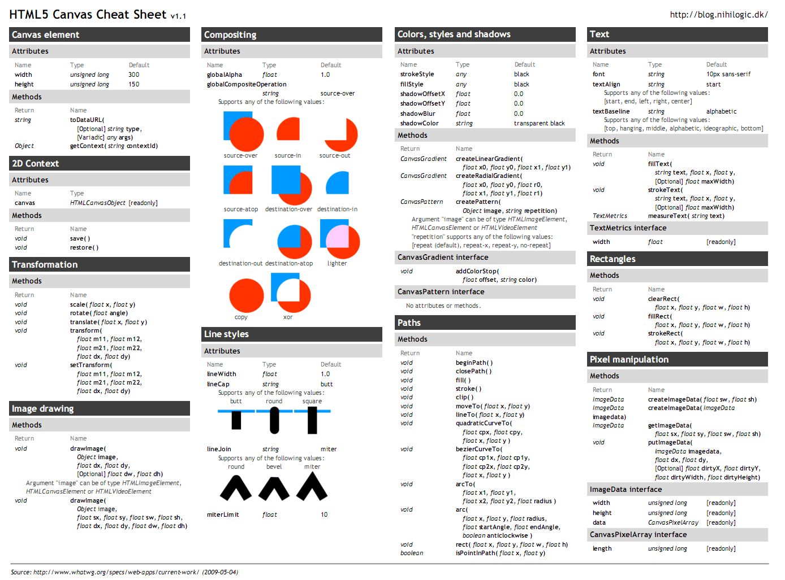

# HTML5 APIs
## Client-side Storage
1. `window.localStorage`
2. `window.sessionStorage`

Since they are properties directly off the window object, we can access them by simply `localStorage` and `sessionStorage`.

`sessionStorage` only lasts the current session - until the tab or window is closed. `localStorage` stays around after the browser window/tab closes and stays as long as the browser doesn't delete `localStorage`.

Cookies are sent with each HTTP request along to the server. This is primarily used to store information related to the user's account if they're logged in to a site. With `localStorage`, data is kept client-side.

Cookies only hold 4KB (4096 bytes) of data per site. `localStorage` holds 5MB. Cookies have an expiration date, if not renewed they will be deleted. `localStorage` remains until the user or JavaScript deletes it.

Creating a cookie is a messy process since all cookie data is stored in a single string. `localStorage` stores values in an object with key/value pairs and has methods to set, get, and remove them and clear the entire storage object.

Example:
Allow the user to set the background color and save that info for next time.
```javascript
function setBGColor(hex) {
  localStorage.setItem('bgColor', hex);
}
```
the main shortcoming of `localStorage` is we can only save values as strings.

To retrieve that background color preference later.
```javascript
function getBGColor() {
  return localStorage.getItem('bgColor');
}

$(function() {
  var bgColor = getBGColor();

  $(document.body).css('background-color', bgColor);
});
```

With only being able to store strings, `localStorage` is limited. Use JSON to `parse` and `stringify` objects to save their info.

Example:
Object representing a person:
```javascript
var person = {
  name: 'Amanda Rose',
  bgColor: '#ff0000',
};

function setPerson(personToSave) {
  localStorage.setItem('person', JSON.stringify(personToSave));
}

function getPerson() {
  return JSON.parse(localStorage.getItem('person'));
}
```

## The Canvas API


The very basics of a canvas.
```html
  <script>
    var canvas = document.querySelector('canvas');
    var ctx = canvas.getContext('2d');
  </script>
  <body>
    <canvas width="800" height="600"></canvas>
  </body>
```

Example: Rectangle Animation
```javascript
document.addEventListener('DOMContentLoaded', function() {
  var canvas = document.querySelector('canvas');
  var ctx = canvas.getContext('2d');
  ctx.fillRect(0, 0, canvas.width, canvas.height);

  var colors = ['#000', '#003', '#006', '#009', '#00c', '#00f'];
  function draw() {
    colors.forEach(function(color, i) {
      ctx.fillStyle = color;
      ctx.fillRect(i * 20, i * 20, canvas.width - i * 40, canvas.height - i * 40);
    });
    colors.unshift(colors.pop());
  }

  setInterval(draw, 200);
});
```
Example: Circle
```html
<script>
  document.addEventListener('DOMContentLoaded', function() {
    var canvas = document.querySelector('canvas');
    var ctx = canvas.getContext('2d');

    var x = canvas.width / 2;
    var y = canvas.height / 2;
    var radius = x;

    ctx.beginPath();
    ctx.arc(x, y, radius, 0, 2 * Math.PI);
    ctx.fill();
    ctx.closePath();
  });
</script>
<body>
  <canvas width="400" height="400"></canvas>
</body>
```

Example: Triangle
```javascript
ctx.beginPath();
ctx.strokeStyle = 'rgba(0, 102, 204, .7)';
ctx.moveTo(x, y - 50);
ctx.lineTo(x + 50, y);
ctx.lineTo(x - 50, y);
ctx.lineTo(x, y - 50);
ctx.stroke();
ctx.closePath();
```

Example: Save canvas as image
```javascript
var img_src = canvas.toDataURL('png');
var img = document.createElement('img');

img.src = img_src;
document.body.appendChild(img);
```

Example: Draw img to canvas
```javascript
var img = document.querySelector('img');

// Change canvas dimensions to img dimensions
canvas.width = img.width;
canvas.height = img.height;

ctx.drawImage(img, 0, 0)
```

Use `getImageData` and `putImageData` to access and set the rgba data.
