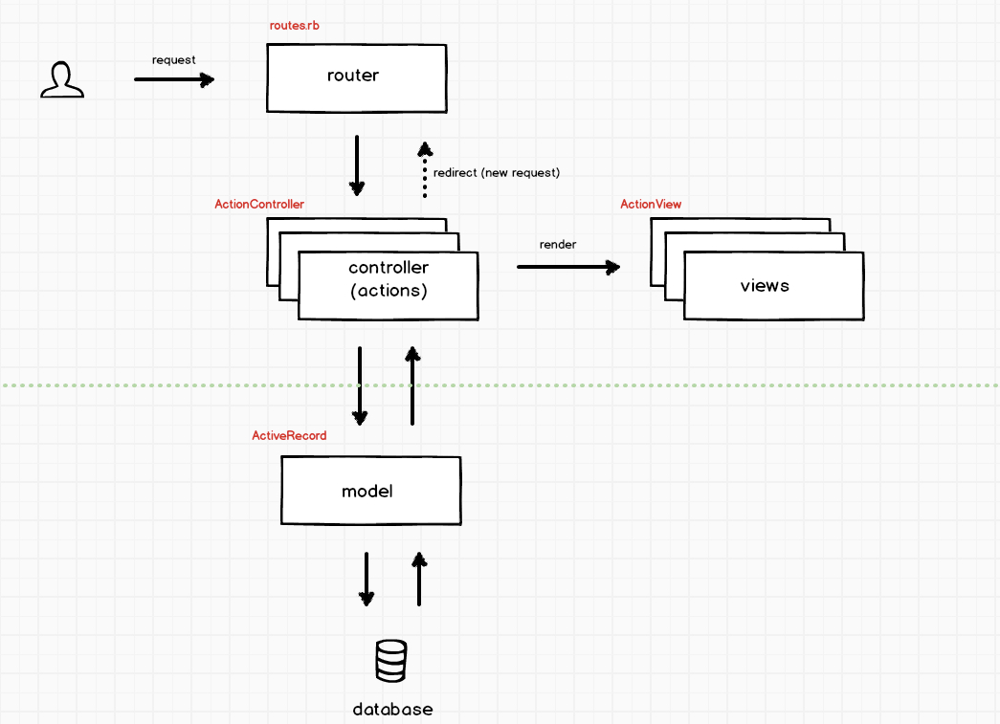
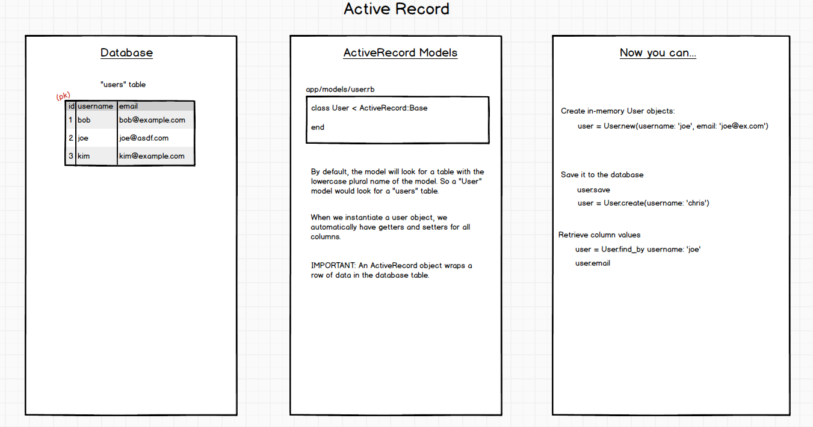
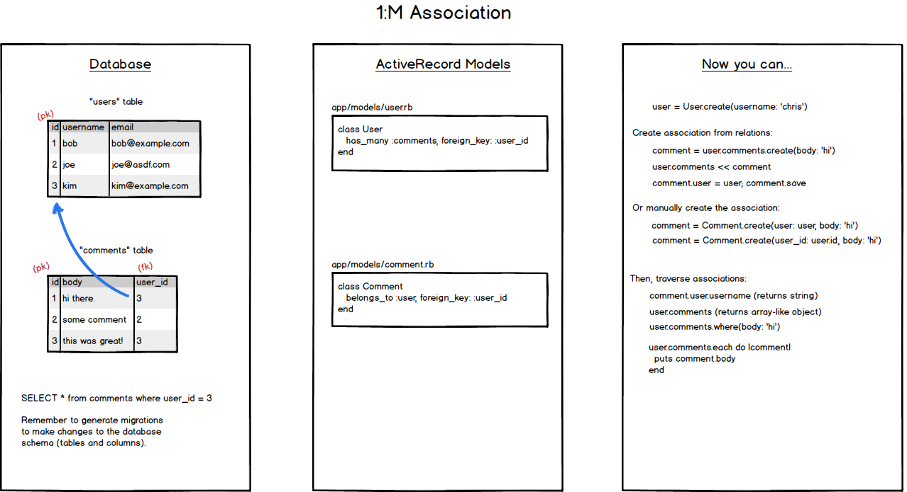
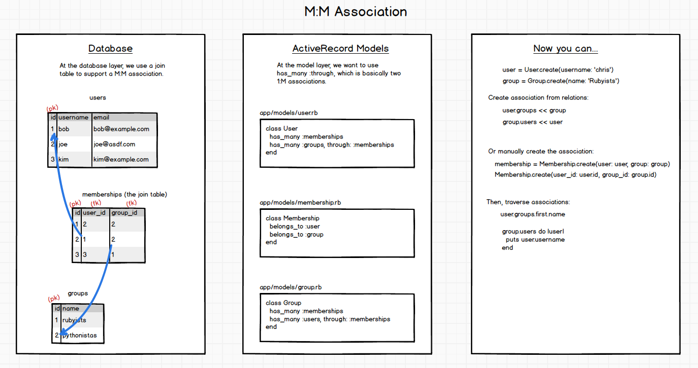
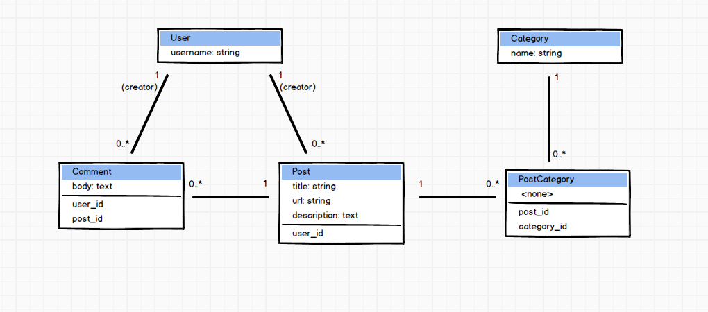

# Lesson 1
## Lecture 1

Start an app by running `rails new myapp` where `myapp` is the name of the app.

3 files to focus on upon app creation:

1. database.yml
  * Tells the app how to connect to the database. Default is to use sqlite3. sqlite3 is lightweight, easy. In production, postgres will likely be used. The database file is actually in the `db` folder of the project when using sqlite3. Usually, though, the database is hosted somewhere and the application connects to it. It is rare to see the database in the codebase
  * Good tip: mimic production environment when in local environment whenever possible.
2. Gemfile
  * Idea of the gems the app relies on
3. routes.rb
  * Shows how the routes are constructed
    * Router uses http verb, url, and parameters to determine where to send the info.
    * router -> ActionController - can render view template or access model
    * ActionView (view) - Render a view template
    * ActiveRecord (model) - check the model and do something to the database
  * this file is a blueprint for the capabilities of the application
  * this file exposes all the endpoints of the application

Rails Project Directories
* app - most time spent here
  * assets - stylesheets, js, etc, static info
  * controllers - `ApplicationController` is the superclass of all controllers
  * helpers - extract out common logic for views
  * mailers - outbound mail
  * models - all models go here
  * views - erb template
* bin - executables sit here, we never touch it.
* config -
  * environments - files that overwrite application.rb configuration settings for specific environments (development, production, test)
  * initializers - run before rest of code. e.g. working with a library like Twilio
  * locales - simple way to internationalize your app
  * application.rb - set app defaults (time zone, load path, etc.)
  * boot.rb - rails boots itself
  * environment.rb - relic from the past - just initializes application now
* db - database file sits here (specific to sqlite) and migration files go here too
* lib - assets go here, just like app -> assets. For now, don't put assets here.
  * tasks - rake tasks go here
* log
  * development.log - this is what streams on the terminal, logs everything
* public - store generic error pages (these should be completely static pages since the dynamic content usually caused the problem)
* test - for testing
* tmp - cache files, pids, don't worry much about this
* vendor - relic from past, plugins etc.
* .gitignore - it says "don't commit these files to git" - essentially it says these files are relevant to my machine, not the production environment or anywhere else - like log files, .bundle, sqlite3 files, etc.
* config.ru - don't touch it, used by rack-based server
* Gemfile and Gemfile.lock - shows gems
* Rakefile - for rake
* README.doc - rendered immediately on github. A description of the project and instruction on how to use it.

### Run-through of rubyonrails/getting_started.html guide
(video used Ruby v 2.0.0 and Rail v 4.0.0)

In app directory...
```bash
rails generate scaffold Post title:string url:string description:text
```

This create a huge number of files - the basic scaffolding needed to handle this model

```bash
rake db:migrate
```

This creates the sqlite database and run the migrations. Now the `db` directory has a `migrate` folder that contains a migration. Viewing the database will show a `posts` table now exists and the schema are present.

```bash
rails server
```

Boots the server (Webrick). Navigating the `localhost:3000/posts` should show the generic templates for listing and handling posts.

Now we can already do CRUD operations for posts.

This is the both the good and the bad of Rails. Productivity was just through the roof. However, I have no idea what all those files are doing. I would be completely lost if I had to make a modification.

In this course we will only use generators for migrations.

**Walk-though of a basic request**
Click enter on localhost:3000/posts
1. request to `/posts`
2. came from `routes.rb` and the line `resources :posts`
3. use `rake routes` to display all the routes (endpoints) of the project that are exposed. go to `/rails/info/routes` to view a dynamic page of routes.
  * contains controller action, path, http verb
4. route is processed by `PostsController#index` action
5. in the `index` method of the `PostController`. `@posts = Posts.all` is the arrow from the controller to the model the requests the array of `post` objects.
6. Back to the controller, now a redirect or a render can occur (render is by default)
7. The view that is rendered is under `views/posts/index.html.erb`. The naming convention used.
8. Have access to instance variables in view file that is rendered.
9. In this view, we can link to other routes. If a dynamic path is needed, must pass in the object that contains the requested info.

## Relational Database

2 Critical Concepts
1. A primary key column that is unique for each row. For Rails this is the `id` column.
2. A foreign key will contain a primary key from another table that links information in rows together.

**Data view** - shows the data
**Schema view** - shows the column titles and their type. The types are set for each column.

### One-to-Many
1 user has many status. One status has many replies.

The foreign key is always on the many side. For "1 user has many comments", the foreign key will be in the `comments` table.

## Active Record
Object Relational Mapper pattern. SQL is the language of the database and before ORM, SQL had to be written directly in code. ORM translates OOP code in Ruby into SQL so we don't have to dive that far down.

An object correlates directly with a row of data. Be default, the model will look for a table with the lowercase plural name of the model. So a "User" model would look for a "users" table.

When we instantiate a user object, we automatically have getters and setters for all columns.

NOTE: An ActiveRecord object wraps a row of data in the database table.

To create a table for users, do this:
```bash
rails generate migration create_users
```

Then in `db/migrate/#########_create_users.rb`

```ruby
class CreateUsers < ActiveRecord::Migration
  def change
    create_table :users do |t|
      t.string :username
      t.timestamps  # update times column
    end
  end
end
```

Now need to create the model. Create file `app/model/user.rb`
```ruby
class User < ActiveRecord::Base
end
```

Can create a `User` using:
```ruby
User.create(username: 'kim')
```

Now we need a foreign key column on the "many" side (the posts tables)

```bash
rails generate migration add_user_id_to_posts
```

Then in `db/migrate/###########_add_user_id_to_posts`
```ruby
class AddUserIdToPosts < ActiveRecord::Migration
  def change
    add_column :posts, :user_id, :integer
  end
end
```

Then run `rake db:migrate` to add the foreign key column to the posts table.

Now we can work with the model layer.

Go to `app/models/post.rb and app/models/user.rb`.

```ruby
class User < ActiveRecord::Base
  has_many :posts
end
```
```ruby
class Post < ActiveRecord::Base
  belongs_to :user # this means foreign key is column `user_id`
end
```

We can now easily grab all of a user's posts
```ruby
user = User.first
post = Post.first
user.posts # return all posts of the user
```

With these associations, we have virtual attributes. These are attributes that are not columns in the database, usually through association. Like `post.user = ` can be used to set the `User` of the post. For `User` it is the collection of posts. For `Post` it is its user.

```ruby
user.posts << post
```
This adds the post to the user.
```ruby
user.posts
post.user
```

### Mass Assignment
Assignment of many columns at once. Opposed to creating a new object then assigning properties one-by-one.
```ruby
Post.new() # mass assign a new Post object (in memory - not in db)
post = Post.new(title: 'some title', url: 'some url', user: User.first)
post.save # to hit the db
# OR
post = Post.create(title: 'some title', url: 'some url', user: User.first)
# This created a new post in memory and then hit the db.
```

## Rails Request/Response Diagram


## ActiveRecord Pattern Diagram
How the AR model connects to database table. The ActiveRecord pattern is a pattern that maps:
* classes to tables
* objects to rows of data within that table
* getters/setters to columns in the table



## 1:M Association
Database and model layers for 1:M association.



## M:M Association
Database and model layers for M:M association.



## Entity Relationship Diagram
This is the initial ERD we'll use to build our app.


## PostIt Project

### Assignment: Post model
Setting up a model requires an associated table in the database. By convention in Rails, the table name should be the lowercase plural of the model name.

Example: `Post` model should have a table in the database called `posts`.

Here's how to set up the model:

1. First, create a migration to modify the database. In this migration, we want to create the table. Rails migrations are the only place where we want to use generators. Issue this command from the terminal within your project directory: `rails generate migration create_posts`
2. Open the newly created migration file in your code editor, and take a look at the migration file. Use the `create_table` method to create the necessary table and columns. We want: a `url` and `title`, which should both be strings and a `description` which should be text.
3. From the terminal again, issue this command: rake `db:migrate` (you may need to do rake `db:create` first, if you're using mysql or postgres). If you're getting a rake error, you can try adding `bundle exec` before the rake command.
4. Then take a look at your database and see that you have a posts table, with three columns: url, title and description.
5. Create a Post model file: under app/models directory, create a post.rb file put `class Post < ActiveRecord::Base; end`
6. Open `rails console`, and create your first Post object: `Post.create(title: "My first post", description: "I sure hope this works!", url: "www.yahoo.com")`. Verify by looking at your database that this worked.

### Assignment: User model
Same as the Post model, except the User model should have a `username` column of type string.

### Assignment: 1:M between User and Post
It's a two step process:

1. First, we need to modify the database to create a new foreign key column on the posts table to support the one to many association. Remember, the foreign key column always goes on the 'many' side. Hint: generate a migration file, then use Rails migration syntax to create a new column.

2. Now, we can declare the associations in the models.

### Assignment: Verify in "rails console"
From the rails console, verify that your associations are set up correctly.

1. Create some data to populate the posts and users tables.
2. Associate the data by setting the foreign key column in posts table with a user id.
3. Then, see if you can traverse the association:

Example code:

```ruby
post = Post.find(1)
post.user
post.user.username
```

### Assignment: Comment model
Create a Comment model, with a `body` attribute to store the comment's text. It can't be a "string" because strings have limited size restriction, so it has to be of type "text".

Note that the Comment model has two associations: one with the User model to track who created it, and another with the Post model to track which post this comment is for. You'll need two 1:M associations. Keep this in mind when creating the migration.

### Assignment: Comment associations
Set up the two 1:M associations for the Comment model, and verify that everything is wired up correctly in rails console.

* with User, to track who created the comment
* with Post, to track what this comment is about

## Lecture 2

### Review and explanation of migrations
`ActiveRecord` abstracts away the database that stores data. A database is a completely separate application from Ruby and Rails.

Migrations are the instructions that explain how the database should be constructed. There can be many migrations that instruct, in sequence, the incremental changes made to the database over time. They modify the schema of a database in a systematic way.

`rake db:rollback` command will undo the last migration. Reverses the last migration and removes that migration from the list of migrations that have been run. When it reverses the migration the data in whatever was created is lost, forever.

Using the `rails generate` for creating migration will create a timestamp in the filename to keep the migrations in order.

### has_and_belongs_to_many vs has_many_through

Database layer:
- join table relates information across tables
- keeps track of the unique combination of the primary keys of multiple associated tables

(Rails) Model layer:
1. has_and_belongs_to_many
  - no join model
  - implicit join table at db layer
    - table1_name_table2_name ex: groups_users

  Problems:
  - prevents us from having a join model so we can't hang additional attributes (columns) on it

2. has_many :through (Advised to always use this just in case you need additional attributes)
  - has a join model
  - can put additional attributes (columns) on association

  Problems:
    - has a join model (one additional table)

### Resources and Routes

In `routes.rb`, suppose we want a route to display all posts using the posts#index controller

```ruby
get '/posts', to: 'posts#index'
```

The inside `posts/index.html.erb` we can have `render posts/index` to render the template

A get to an individual post may look like this
```ruby
get 'posts/:id', to: 'posts#show'
```

This will map to the `#show` action in the posts controller.

We will end up with a bunch of routes and this pattern would be the same for just about any resource we have:
```ruby
  get '/posts', to: 'posts#index'
  get '/posts/:id', to: 'posts#show'
  get '/posts/new', to: 'posts#new'
  post '/posts', to: 'posts#create'
  get '/posts/:id/edit', to: 'posts#edit'
  patch '/posts/:id', to: 'posts#update'
```

Nowadays we can simply write:
```ruby
resources :posts, except: [:destroy]
```
and all of those routes will be created.

The `except: [:destroy]` limits this from being exposed to the world. Tip: only expose the routes you will utilize.

Resources can be nested so the `/` is not cluttered and the nesting is intuitive
```ruby
resources :posts, except: [:destroy] do
  resource :comments, only: [:create]
end
```

#### Named routes
We never want to write a URL as a string. Instead, use the named route.

```erb
# Dont use this
<%= link_to 'go back to all posts', '/posts' %>
# Instead use this
<%= link_to 'go back to all posts', posts_path %>
```
`posts_path` is a method that returns the correct string. Why use it?
- if app changes from http to https, all links need to change. The methods make it easy.
