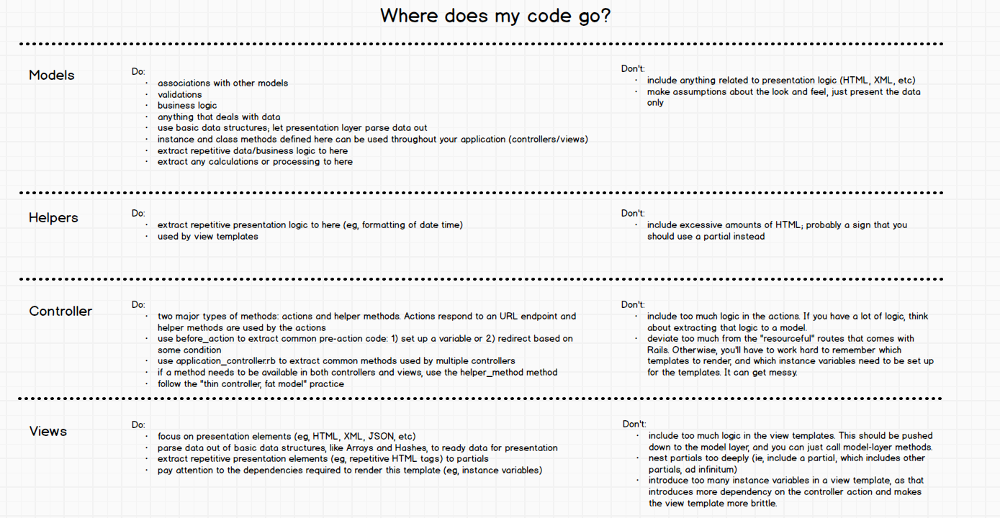

# Lesson 2
## Lecture 3
### Forms
3 ways

#### Pure HTML
```html
<form action='/posts' method='POST'>
  Title: <input type='text'>
  <br/>
  <input type='submit'>
</form>
```

Rails has CSRF (cross site request forgery) to prevent forms submitting data the application by embedding a token into the form that is automatically generated.
This is found in the ApplicationController.
Using a pure HTML won't work with CSRF.

#### Rails Form Helpers
```ruby
<%= form_tag '/posts' do %>
  <%= label_tag :title %>
  <%= text_field_tag :title %>
  <br />
  <%= submit_tag "Create Post", class: 'btn btn-primary' %>
<% end %>
```
2 extra divs are created by the form helpers for an encoding and also for an authenticity token. This value is needed to pass through the CSRF.

#### Rails model-backed form helpers
```ruby
<%= form_for @post do |f| %>
  <%= f.label :title %>
  <%= f.text_field :title %>
  <br />
  <%= f.submit "Create Post", class: 'btn btn-primary' %>
<% end %>
```

The `@post` can be a new post object or an existing one. Rails will populate the form with the post data if using an existing one. Rails will also add an additional hidden input to the form with name `_method` with a value of `patch` with modifies the method from the normal `post` to `patch` so that the post will be updated instead of creating a new one.
So the `new` post form and the `edit` post form can be identical because `form_for` knows what to do.

`form_for` takes an object will determine where to submit to and what the method should be.
Needs to be setup in the `new` action.

When the form is submitted it will be in a nested structure. In the `params` there will be `post` and that will be a hash that has `title` as a key.

Then we can easily do Post.create(params[:post]) which will pass all post parameters to the create method.

### Strong Parameters

They are used to allow only certain params. Wrap the params in a method specifying the only params you want to allow to be mass-assigned.

```ruby
private

def post_params
  params.require(:post).permit(:title, :url)

  # more control here
  if user.admin?
    params.require(:post).permit!
  else
    params.require(:post).permit(:title, :url)
  end
end
```

### Common Pattern
```ruby
@post = Post.new(post_params)

if @post.save
  flash[:notice] = "Your post was created."
  redirect_to posts_path
else
  render 'new'
end
```
Essentially, if the save works then redirect, if not then render the page again with some kind of explanation for failure.

### Validations
Always added to the model layer.
```ruby
validates :title, presence: true
```
Means that a title is required.

Use `post.errors` to view the errors.
Use `post.errors.full_messages` to get an array of all the error messages.

### Before action
Run some code before a list of actions. A way to keep code even more dry.
Ex: `@post = Post.new` is redundant in several actions.

Use

Use them for two reasons:
1. Setup an instance variable
    ```ruby
    before_action :set_post, only: [:show, :edit, :update]

    private

    def set_post
      @post = Post.find(params[:id])
    end
    ```
2. Redirect based on some condition. The original action will no longer execute. Can be used for authentication.

### NOTES
#####Sharing of the `_form.html.erb` partial
You should understand now that the typical restful Rails controller has the following actions: `index`, `show`, `new`, `create`, `edit`, `update`, and `destroy`. Further, you should understand the intricate relationship between the `new/create` actions and the `edit/update` actions. The fact that these 4 action share 1 form partial also means that the form partial's dependencies (mostly, instance variables), must be set up in 4 different actions. This is extremely tricky, but works wonderfully if you follow Rails conventions. There will be many times where you will need to deviate from this convention, and you must keep in mind that view templates' dependencies must be set up correctly in all actions that render that template.

##### CRUD
CRUD is an acronym that stands for "create", "retrieve", "update" and "delete". You'll hear many developers say something like "we just need a CRUD web interface for tickets". This is what Rails gives us out of the box: an ability to perform basic CRUD actions on a resource as a web application. Below is how the default Rails actions map to CRUD:

* Create: `new`, `create`
* Retrieve: `index`, `show`
* Update: `edit`, `update`
* Delete: `destroy`

##### Render vs Redirect
You should also understand what a render is vs a redirect. Render compiles the template into HTML and sends the HTML back as part of the response. Redirect sends back a URL as part of the response; there's no HTML in a redirect. Most browsers follow the redirected URL automatically, and a new request is issued. All redirects will eventually lead to rendering of some template, otherwise your browser will display a "too many redirects" error.

Why does the URL stay at `/posts` when there's a validation error? Shouldn't it be `/posts/new`?
The request URL is what's showing up in the address bar, not the response. The response is processed by your browser. The request URL is shown in the address bar.

In the case of a new post form submission, the request URL is `/posts`. This has nothing to do with the response sent back. The URL only changes on successful post creation because in that case the response is a redirect, and your browser issues a new request, which changes the address bar.

### Nested Resources
Something like this.
```ruby
resources :posts, except: [:destroy] do
  resources :comments, only: [:create]
end
```
The route for creating a new comment will be nested inside the post route.
```
/posts/:post_id/comments
```

When building a form using `form_for`, need an array of objects.
```ruby
<%= form_for [@post, @comment] do |f| %>
  <div class="control-group">
    <%= f.label :body, 'Leave a Comment' %>
    <%= f.text_area :body, class: 'span4', rows: 3 %>
  </div>
  <%= f.submit 'Create Comment', class: 'btn btn-primary' %>
<% end %>
```

### Helpers
Keep presentation logic out of views. Place them in helpers. Use for presentation logic that is redundant. The model deals with application logic, not presentation logic. Helps to prevent scattering code throughout view templates.

### Where Does Code Go?


## Quiz: Lesson 2
1. Name all the 7 (or 8) routes exposed by the `resources` keyword in the `routes.rb` file. Also name the 4 named routes, and how the request is routed to the controller/action.

| name | HTTP Verb | Route | Controller#Action |
| --- | --- | --- | --- |
| posts | GET | /posts | posts#index |
| | POST | /posts | posts#create |
| new_post | GET | /posts/new | posts#new |
| edit_post | GET | /posts/:id/edit | posts#edit |
| post | GET | /posts/:id | posts#show |
| | PUT/PATCH | /posts/:id | posts#update |
| | DELETE | /posts/:id | posts#destroy |

---

2. What is REST and how does it relate to the `resources` routes?

REST stands for Representational State Transfer. There are 4 main actions that can occur for any resource - `create`, `read`, `update`, `delete`. The routes follow this convention where 4 routes perform one of those actions. The other routes help prepare for those actions.

---

3. What's the major difference between model backed and non-model backed form helpers?

Model-backed forms can only include inputs for that model's attributes or virtual attributes. Non-model-backed forms can contain anything.

---

4. How does `form_for` know how to build the `<form>` element?

Inside `form_for`, it will determine if the object passed into it is a new object or an existing one. This determines if the form will be pre-popoulated. `form_for` also have numerous helper methods used to create each element inside the form.

---

5. What's the general pattern we use in the actions that handle submission of model-backed forms (ie, the `create` and `update` actions)?

```ruby
if @obj.save
  redirect_to obj_path
else
  render :new
end
```

---

6. How exactly do Rails validations get triggered? Where are the errors saved? How do we show the validation messages on the user interface?

No idea exactly how the validations are triggered. The errors are saved on the object itself. We can iterate through the `object#errors.full_messages` array to display the messages to the user interface.

---

7. What are Rails helpers?

Rails helpers are used to extract our formatting logic. They are stored in the `app/helpers` folder.

---

8. What are Rails partials?

Rails partials are used to extract out common parts of views such as a form or a structure for a heading.

---

9. When do we use partials vs helpers?

Partials contain the HTML and the logic needed to determine what to display. Helpers don't decide *what* to display, just *how* to display it.

---

10. When do we use non-model backed forms?

When we are no longer following the Rails convention.

---

### LS Solution
1. Name all the 7 (or 8) routes exposed by the resources keyword in the routes.rb file. Also name the 4 named routes, and how the request is routed to the controller/action.

```
# Assuming you are getting resources :posts

$ rake routes

get '/posts', to: posts#index                => posts_path
get '/posts/object', to: posts#show          => post_path(object)
get '/posts/object/edit', to: posts#edit     => edit_post_path(object)
get '/posts/new', to: posts#new              => new_post_path
post '/posts', to: posts#create
patch '/posts/object', :to: posts#update
put '/posts/object', to: posts#update
delete '/posts/object', to: posts#destroy
```

---

2. What is REST and how does it relate to the resources routes?

REST stands for "REpresentational State Transfer" and it relies on using a stateless, client-server, cacheable communications protocol. In our case majority of the time, the HTTP protocol is used. RESTful applications use HTTP requests to create, retrieve, update, and delete data (aka CRUD operation). Thus, REST uses HTTP for all four of these actions. When we use resources routes, we are mapping the browser requests (HTTP verbs and URLs) to the controller actions of our app, allowing it to work seamlessly on the web.

---

3. What's the major difference between model backed and non-model backed form helpers?

The major difference is that model backed form helpers are tied to an object. There has to be a setter method, a virtual attribute or a column in the database, available for that object when using the model backed form helpers. We use model backed form helpers usually when we need to create, edit, or update an object.

---

4. How does `form_for` know how to build the `<form>` element?

By convention, `form_for` creates a form based on a specific model object. We are able to create, edit, and update that object's attributes. A form can be created by passing `form_for` a string or symbol relating to the object we want to deal with.

```ruby
<%= form_for @posts do |f| %>
    <%= f.label :title %>
    <%= f.text_field :title %>
<% end %>
```

---

5. What's the general pattern we use in the actions that handle submission of model-backed forms (ie, the `create` and `update` actions)?

```ruby
def create
    @post = Post.new(params.require(:post).permit(:url, :title, :description))

    if @post.save
        flash[:notice] = "Your post was saved."
        redirect_to posts_path
    else
        render :new
    end
end

def update
	@post = Post.find(params[:id])

	if @post.update(params.require(:post).permit(:url, :title, :description))
	    flash[:notice] = "Your post was updated."
	    redirect_to post_path(@post)
	else
		render :edit
	end
end
```

---

6. How exactly do Rails validations get triggered? Where are the errors saved? How do we show the validation messages on the user interface?

Rails validations are triggered when the data submissions try to hit the database. The errors are saved on the model object. When there are validation errors, they are saved to the object.errors. We display the validation messages by referencing the object.errors.full_messages method like below. By using the full_messages method, the errors are displayed in a nice, readable sentence format.

```ruby
<% if obj.errors.any? %>
  <div class="row">
    <div class="alert alert-error span8">
      <h5>Please fix the following errors:</h5>
      <ul>
        <% obj.errors.full_messages.each do |msg| %>
          <li><%= msg %></li>
        <% end %>
      </ul>
    </div>
  </div>
<% end %>
```

---

7. What are Rails helpers?

Rails helpers allow us to consolidate our application's logic and formatting so we can properly display information in the views. By declaring helper methods within the "application_helper.rb" file, we are able to use the methods in the views without convolving the views with logic code.

---

8. What are Rails partials?

Rails partials are a type of view that enable us to store and share common HTML files amongst all of the views. Partial files are named with an underscore at the beginning, for example: _errors.html.erb

---

9. When do we use partials vs helpers?

A partial is a view fragment with HTML code that is usually shared and used multiple times in view files. It should consists of code that is for presentation purposes only. On the other hand, while helpers also reduce code duplications, they are meant to be used when there is some logic to be processed within a view. This will eliminate the views to be consumed by logic, and instead, the views can remain "pure" for presentation usages.

10. When do we use non-model backed forms?

You can use a non-model backed form when you want to create a form that is not tied to a model. We can think of a non-model backed form as generating pure HTML rather than binding the form with a model object.

---
