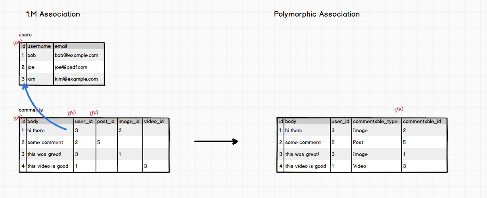
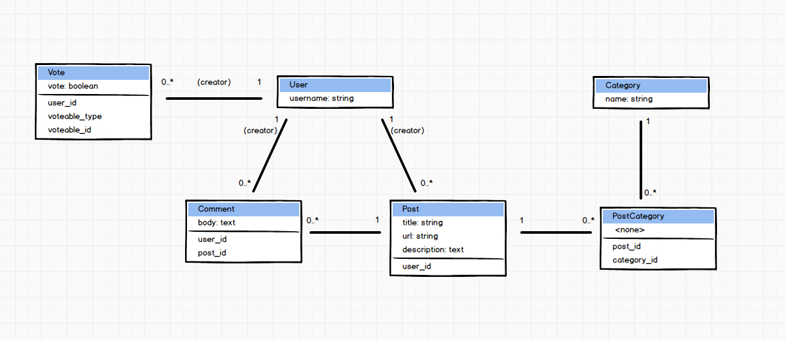

# Lesson 3
## Asset pipeline
Obfuscate and compress static assets when deploying application to production.

**Compress** - To take a bunch of assets and merge them.
* helps with bandwidth. Only a couple of files need to be downloaded. Browsers usually can download 10 files at a time.

**Obfuscation**
* renames variables and removes whitespace so it is incredibly difficult to be read by humans.

At deployment, grab all assets, obfuscate and jam it into one file, and move it into the public/assets directory.

There is a large code in the file names of these assets to help with caching. When an asset is patched the user's browser will see a different code on the asset name and know to get the new file and not use the old cached file.

**Sprockets** - A library that manages assets. Located in `application.js` file. Does the above

Sprockets does this compilation and obfuscation at deployment time but it can be done manually anytime you want using `rake assets:precompile`. Heroku will do this automatically for us.

## Authentication from Scratch
`rails generate migrations add_pass_word_digest_to_users`

```ruby
class AddPassWordDigestToUsers < ActiveRecord::Migration
  def change
    add_column :users, :password_digest, :string
  end
end
```

`rake db:migrate`

```ruby
class User < ActiveRecord::Base
  has_many :posts
  has_many :comments

  has_secure_password validations: false
end
```

Make sure `gem bcrypt-ruby ~>3.0.0` is in the `Gemfile`

Use the `#password` setter to set the password. Use `#authenticate` to retrieve the Object you're trying to access. If the password is correct, the object will be returned, if incorrect, `false` will be returned.

### Polymorphic Associations: Database and Models

A different way to build 1:M associations.

Take for example the comments where a user can make a comment on a post. In the comments table, each row (comment) can only have one user but that user can make many comments. So for a given user, the `post_id` (or any other this the user comments on), is mutually exclusive. So a comment can be associated to many many different things; comment on a post, photo, video, etc.

Instead of adding a hundred columns for each type of item that can be commented upon, use just two columns - one for the `commentable_type` and one for the `commentable_id`.

```ruby
class CreateVotes < ActiveRecord::Migration
  def change
    t.boolean :vote
    t.integer :user_id
    t.string :voteable_type
    t.integer :voteable_id
    t.timestamps
  end
end

class Vote < ActiveRecord::Base
  belongs_to :creator, class_name: 'User', foreign_key: 'user_id'
  belongs_to :voteable, polymorphic: true
end

class User < ActiveRecord::Base
  has_many :posts
  has_many :comments
  has_many :votes

  has_secure_password validations: false

  validates :username, presence: true, uniqueness: true
  validates :password, presence: true, on: :create, length: {minimum: 5}
end

class Post < ActiveRecord::Base
  # Must be explicit when deviating from convention
  belongs_to :creator, foreign_key: 'user_id', class_name: 'User'
  has_many :comments
  has_many :post_categories
  has_many :categories, through: :post_categories
  has_many :votes, as: :voteable

  validates :title, presence: true, length: { minimum: 5 }
  validates :description, presence: true
  validates :url, presence: true, uniqueness: true
end
```



#### ERD Final

